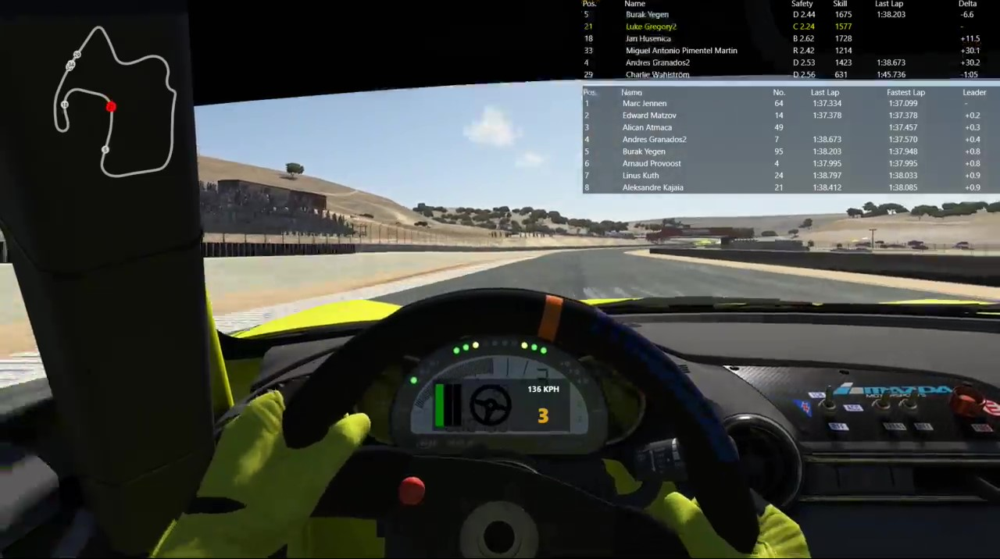
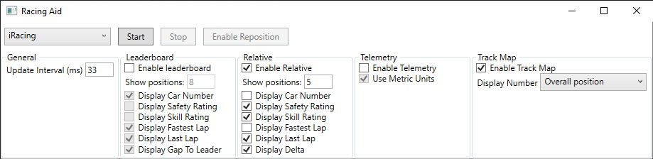
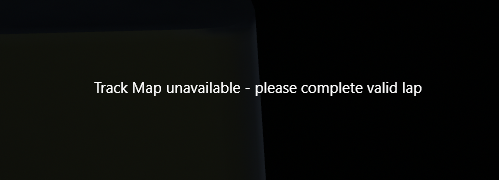
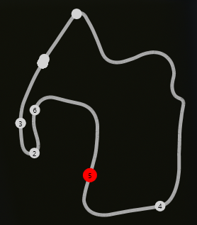
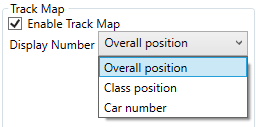

# RacingAid

*This application is still under development, but pre-release versions are available for
anyone that wishes to give it a trial run*

RacingAid is a free, open-source overlay application designed for sim drivers who want a
simple overlay that can be used for a variety of racing games

*NOTE: RacingAid currently only supports iRacing, but support for more racing games is
currently under development.*

## Demo

**NOTE: The visuals are a WIP, and will be continuously updated as development continues**



## Setup

Simply download the zip file from the [latest build](https://img.shields.io/github/v/release/LGregg11/RacingAid) or from a build in the list of existing [releases](https://github.com/LGregg11/RacingAid/releases) or [tags](https://github.com/LGregg11/RacingAid/tags).

Once you have a build, unzip the folder and follow the prerequisites (listed below) for the
sim you wish to use.

From there, simply run the application executable (.exe).

### Required setup for supported games

#### iRacing

Go to the iRacing app.ini (Can be found at `C:\Users\<user>\documents\iRacing\app.ini`)
and under `[Misc]` set `irsdkEnableMem=1`. Make sure to save and restart the application.

## How to use

### Start

When the application is launched, the user will be met with the main window:



Ensure you have chosen the sim you are playing in the top left dropdown.

Press `Start`. Once you are in a lobby, the enabled overlays will appear.

### Configuration settings

All the settings seen in the Main Window are configurable and will be saved (assuming they are
valid) in a config file found at `%APPDATA%/RacingAid/Config/config.ini`.

### Reposition Overlays

To reposition the overlays, click `Enable Reposition`. You will be able to drag and move the 
overlays into your desired position. Once completed, press `Disabled Reposition`. This will 
save the position of the overlays so that you do not have to reposition them when the app is
next used.

Overlay position data can be manually updated at `%APPDATA%/RacingAid/Data/OverlayPositions.json`

### Track Map

When first joining a session for a track you have not yet raced, you will be presented with 
the text `Track Map unavailable - please complete valid lap`:



Once you complete a valid lap (i.e. 1 full lap with no track limit warnings and not starting
or finishing in the pits), the track map will appear:



As you can see, the track map will highlight the local driver (you) and display all other
drivers on the track. In the example, the number for each driver represents their overall 
position (this is a practice session where some drivers may not have set times yet), but 
there are a list of options to display from the TrackMap config section in the main window:



Track map data can be obtained at `%APPDATA%/RacingAid/Data/TrackMaps.json`

## For developers

### RacingAidWpf

RacingAidWpf is a WPF application that displays a variety of information as an overlay 
over a racing game

### RacingAidData

RacingAidData is an open-source .NET Library for developers that want a seamless way to
create an application for a variety of racing games. The library contains a set of data 
subscription classes that feed data output from the desired racing game and deserializes
the information into generic data models.

The aim of this library is to make it easy for developers to create their applications 
using the supported subscribers and deserializers, or to produce their own and for 
unsupported games and inject them into the RacingAid application and still use the same
generic models for the output (NOTE: This latter feature is not currently implemented).

#### Using RacingAid as a developer

Below is a basic example of how you can use the `RacingAidData` .NET library in your
application to easily obtain iRacing data.

```C#
var racingAid = new RacingAid();
racingAid.SetupSimulator(Simulator.iRacing);
racingAid.ModelsUpdated += OnModelsUpdated;
racingAid.Start();

..

private void OnModelsUpdated()
{
    Console.WriteLine($"Driver's latest speed (m/s): {racingAid.Telemetry.SpeedMs}");
}

```

